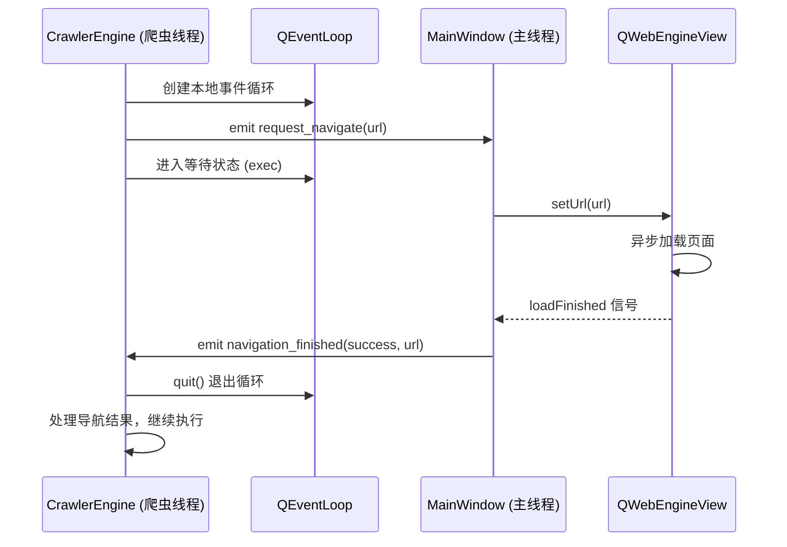

# 浏览器抓取架构调整实施设计

## 实施概述

本设计文档旨在指导将现有基于 Playwright 的网页抓取系统迁移至基于 PyQt6 QWebEngineView 的内嵌抓取架构。根据 `browser-scraping-adjustment.md` 的设计方案，本文档将提供具体的实施路径、组件改造方案及风险控制措施。

## 实施范围

### 需要移除的组件

| 组件名称 | 文件路径 | 移除原因 |
|---------|---------|---------|
| PlaywrightController | src/browser/playwright_controller.py | 无法与QWebEngineView集成 |
| Playwright依赖 | requirements.txt | 不再使用外部浏览器自动化 |

### 需要改造的组件

| 组件名称 | 文件路径 | 改造类型 | 改造范围 |
|---------|---------|---------|---------|
| CrawlerEngine | src/crawler/crawler_engine.py | 重构 | 浏览器交互逻辑完全重写 |
| CrawlThread | src/ui/main_window.py | 增强 | 添加跨线程通信信号 |
| MainWindow | src/ui/main_window.py | 增强 | 添加浏览器操作处理方法 |
| CookieManager | src/browser/cookie_manager.py | 适配 | 适配QWebEngine的Cookie API |

### 保持不变的组件

- DataExtractor (src/crawler/data_extractor.py) - 数据提取逻辑
- DataExporter (src/crawler/data_exporter.py) - 数据导出逻辑
- 数据库模型 (src/database/models.py) - 配置存储结构
- 用户界面布局 - 界面框架保持不变

## 核心技术方案

### 跨线程通信机制

#### 信号定义方案

在 CrawlThread 类中新增以下信号用于请求主线程操作浏览器：

| 信号名称 | 参数类型 | 发送时机 | 用途说明 |
|---------|---------|---------|---------|
| request_navigate | str (url) | 需要导航到新页面时 | 请求主线程执行页面导航 |
| request_html | 无参数 | 需要获取当前页面HTML时 | 请求主线程返回页面内容 |
| request_execute_js | str (script) | 需要执行JavaScript时 | 请求主线程执行JS代码 |
| request_check_element | str (selector) | 需要检查元素存在性时 | 请求检查页面元素 |

在 MainWindow 类中新增以下信号用于返回操作结果：

| 信号名称 | 参数类型 | 触发时机 | 用途说明 |
|---------|---------|---------|---------|
| navigation_finished | bool (success), str (url) | 页面导航完成后 | 通知导航结果 |
| html_ready | str (html) | HTML提取完成后 | 返回页面HTML内容 |
| js_executed | object (result) | JavaScript执行完成后 | 返回JS执行结果 |
| element_check_result | bool (exists) | 元素检查完成后 | 返回元素存在性 |

#### 同步等待机制

**实现策略**：
- 在 CrawlThread 中使用 QEventLoop 实现同步等待异步操作
- 每次发出请求信号后，创建局部事件循环阻塞等待
- 收到主线程返回信号后，退出事件循环并继续执行
- 设置超时机制防止无限等待

**等待流程**：



### QWebEngineView 操作封装

#### 页面导航处理

**MainWindow 新增方法签名**：

| 方法名 | 参数 | 返回值 | 职责 |
|-------|------|--------|------|
| handle_navigate_request | url: str | None | 处理导航请求，设置页面URL |
| on_page_load_finished | success: bool | None | 页面加载完成回调，发送结果信号 |

**操作流程**：
1. CrawlThread 发出 request_navigate 信号
2. MainWindow.handle_navigate_request 槽函数被调用
3. 调用 browser_view.setUrl(QUrl(url))
4. 连接 browser_view.loadFinished 信号到临时槽函数
5. 页面加载完成后，发出 navigation_finished 信号
6. CrawlThread 接收信号，事件循环退出

#### HTML 内容提取

**MainWindow 新增方法签名**：

| 方法名 | 参数 | 返回值 | 职责 |
|-------|------|--------|------|
| handle_html_request | 无 | None | 处理HTML获取请求 |
| on_html_received | html: str | None | HTML提取回调，发送HTML内容信号 |

**操作流程**：
1. CrawlThread 发出 request_html 信号
2. MainWindow.handle_html_request 槽函数被调用
3. 调用 browser_view.page().toHtml(callback)
4. 回调函数接收HTML后，发出 html_ready 信号
5. CrawlThread 接收信号并保存HTML内容

#### JavaScript 执行

**MainWindow 新增方法签名**：

| 方法名 | 参数 | 返回值 | 职责 |
|-------|------|--------|------|
| handle_js_request | script: str | None | 处理JavaScript执行请求 |
| on_js_result | result: Any | None | JS执行回调，发送执行结果 |

**常用JavaScript脚本**：

| 操作 | JavaScript代码 | 返回值类型 |
|-----|---------------|-----------|
| 点击元素 | document.querySelector('{selector}').click() | None |
| 检查元素存在 | document.querySelector('{selector}') !== null | bool |
| 获取当前URL | window.location.href | str |
| 滚动到底部 | window.scrollTo(0, document.body.scrollHeight) | None |
| 获取页面高度 | document.body.scrollHeight | int |

### CrawlerEngine 重构方案

#### 构造函数调整

**旧版本**：
```
def __init__(self):
    self.browser = PlaywrightController(headless=False)
    self.extractor = DataExtractor()
    self.exporter = DataExporter()
```

**新版本职责**：
- 移除 PlaywrightController 初始化
- 保留 DataExtractor 和 DataExporter
- 新增信号引用属性用于跨线程通信
- 添加当前状态变量（用于同步等待结果）

**新增属性**：

| 属性名 | 类型 | 用途 |
|-------|------|------|
| thread_signals | QObject | 存储线程信号引用 |
| pending_html | str | 临时存储从主线程返回的HTML |
| pending_js_result | Any | 临时存储从主线程返回的JS结果 |
| pending_navigation_success | bool | 临时存储导航结果 |
| current_event_loop | QEventLoop | 当前使用的事件循环 |

#### 核心方法重构

**start_crawl 方法调整**：

| 原实现 | 新实现 | 变化说明 |
|-------|--------|---------|
| async def start_crawl | def start_crawl (同步方法) | 移除async，使用信号槽替代异步 |
| await self.browser.start() | 移除 | 不再启动独立浏览器 |
| await self.browser.goto(url) | 发送 request_navigate 信号并等待 | 通过信号请求主线程操作 |
| await self.browser.get_content() | 发送 request_html 信号并等待 | 通过信号获取HTML |
| await asyncio.sleep(...) | time.sleep(...) | 使用同步延迟 |

**导航方法实现**：

导航操作流程：
1. 发出 request_navigate 信号，携带目标URL
2. 创建 QEventLoop 并设置超时定时器（默认30秒）
3. 进入事件循环等待
4. 接收 navigation_finished 信号后退出循环
5. 返回导航是否成功

**HTML获取方法实现**：

HTML获取流程：
1. 发出 request_html 信号
2. 创建 QEventLoop 并设置超时定时器（默认10秒）
3. 进入事件循环等待
4. 接收 html_ready 信号后，将HTML存储到 pending_html
5. 退出事件循环并返回HTML内容

**翻页逻辑调整**：

| 翻页类型 | 原实现 | 新实现 |
|---------|--------|--------|
| button | 调用 browser.click(selector) | 发送 request_execute_js 信号执行点击JS |
| url | 解析URL参数并调用 goto | 构造新URL并发送 request_navigate 信号 |

**元素检查方法**：

元素检查流程：
1. 发送 request_execute_js 信号，脚本为检查元素存在的JS
2. 等待 js_executed 信号返回
3. 解析返回的布尔值

### CookieManager 适配方案

#### QWebEngine Cookie API 集成

**原实现基础**：
- 当前 CookieManager 支持加密存储和加载Cookie
- Cookie格式为 Playwright 的字典格式

**适配目标**：
- 集成 QWebEngineProfile 的 CookieStore
- 实现与 QWebEngineCookieStore 的双向同步
- 保持加密存储功能

#### 新增方法

| 方法名 | 参数 | 返回值 | 职责 |
|-------|------|--------|------|
| sync_from_profile | profile: QWebEngineProfile, site_id: str | bool | 从浏览器同步Cookie到文件 |
| sync_to_profile | profile: QWebEngineProfile, site_id: str | bool | 从文件加载Cookie到浏览器 |
| convert_qcookie_to_dict | cookie: QNetworkCookie | Dict | 转换Cookie格式 |
| convert_dict_to_qcookie | cookie_dict: Dict | QNetworkCookie | 转换Cookie格式 |

#### Cookie 格式转换

**QNetworkCookie 字段映射**：

| QNetworkCookie属性 | 字典键名 | 类型 | 说明 |
|-------------------|---------|------|------|
| name() | name | str | Cookie名称 |
| value() | value | str | Cookie值 |
| domain() | domain | str | 域名 |
| path() | path | str | 路径 |
| expirationDate() | expirationDate | str (ISO格式) | 过期时间 |
| isSecure() | secure | bool | 是否仅HTTPS |
| isHttpOnly() | httpOnly | bool | 是否HTTP Only |

#### 同步时机

**从浏览器同步到文件**：
- 用户点击"保存Cookie"按钮时
- 爬虫任务完成后自动保存
- 应用关闭前

**从文件同步到浏览器**：
- 用户选择网站配置后
- 开始爬虫任务前
- 用户点击"加载Cookie"按钮时

### 等待策略设计

#### 页面加载等待

**基本等待**：
- 使用 QWebEnginePage.loadFinished 信号
- 默认等待页面 DOMContentLoaded 状态

**高级等待条件**：

| 等待类型 | 实现方式 | 适用场景 |
|---------|---------|---------|
| 元素出现 | 轮询执行JS检查元素存在 | 动态加载内容 |
| 网络空闲 | 监听网络请求完成 | AJAX密集页面 |
| 自定义JS条件 | 执行用户提供的JS返回布尔值 | 特殊加载逻辑 |
| 固定延迟 | time.sleep() | 简单等待 |

**等待配置参数**：

| 参数名 | 类型 | 默认值 | 说明 |
|-------|------|--------|------|
| load_timeout | int | 30000 (毫秒) | 页面加载超时 |
| element_wait_timeout | int | 10000 (毫秒) | 元素等待超时 |
| wait_after_load | int | 1000 (毫秒) | 加载完成后额外等待 |
| wait_condition | str | "load" | 等待条件类型 |
| wait_selector | str | "" | 等待的元素选择器 |

#### 轮询等待实现

轮询检查元素流程：
1. 记录开始时间
2. 循环执行：
   - 发送 request_execute_js 信号检查元素
   - 等待返回结果
   - 如果元素存在，返回成功
   - 如果超时，返回失败
   - 否则等待500ms后重试
3. 返回最终结果

### 翻页策略实现

#### 按钮点击翻页

**实施步骤**：

1. **检查按钮存在性**
   - 获取当前页面HTML
   - 使用 DataExtractor.check_element_exists 检查按钮选择器
   - 如果不存在，判定为无下一页

2. **执行点击操作**
   - 构造点击JavaScript：`document.querySelector('{selector}').click()`
   - 发送 request_execute_js 信号执行
   - 等待执行完成

3. **等待页面更新**
   - 记录点击前的URL
   - 等待 loadFinished 信号或URL变化
   - 添加固定延迟确保内容加载

4. **验证翻页成功**
   - 对比URL是否变化
   - 或检查页面内容是否更新

#### URL参数翻页

**实施步骤**：

1. **解析当前URL**
   - 发送 request_execute_js 执行 `window.location.href`
   - 获取当前完整URL

2. **构造下一页URL**
   - 根据配置的 url_pattern 替换参数
   - 支持模板变量：`{page}`, `{offset}`, `{limit}`

3. **导航到新URL**
   - 发送 request_navigate 信号
   - 等待页面加载完成

**URL模板示例**：

| 翻页类型 | URL模板示例 | 变量说明 |
|---------|------------|---------|
| 页码参数 | `https://example.com/list?page={page}` | {page} 自动递增 |
| 偏移量参数 | `https://example.com/api?offset={offset}&limit=20` | {offset} = (page-1)*limit |
| 自定义参数 | `https://example.com/data?start={start}&end={end}` | 需要自定义计算逻辑 |

### 链接跟踪功能

#### 链接提取

**保持现有逻辑**：
- 从抓取的数据中提取包含URL的字段
- 支持从HTML中使用CSS选择器提取链接

**实施调整**：
- 使用 DataExtractor.extract_links 方法
- 无需修改提取逻辑

#### 链接访问

**原实现**：
```
await self.browser.goto(link)
await asyncio.sleep(1)
html = await self.browser.get_content()
```

**新实现流程**：
1. 遍历链接列表
2. 对每个链接：
   - 发送 request_navigate 信号
   - 等待 navigation_finished 信号
   - 发送 request_html 信号
   - 等待 html_ready 信号
   - 使用 DataExtractor 提取数据
   - 标记链接深度和来源

### 异常处理机制

#### 超时处理

**导航超时**：
- 事件循环使用 QTimer 设置超时
- 超时后发出警告日志
- 根据配置决定是重试还是跳过

**HTML获取超时**：
- 设置较短超时时间（10秒）
- 超时后返回空字符串
- 记录错误日志但继续执行

**JavaScript执行超时**：
- 设置中等超时时间（15秒）
- 超时后返回 None
- 根据操作类型决定是否中止

#### 错误恢复策略

| 错误类型 | 严重级别 | 处理策略 |
|---------|---------|---------|
| 页面加载失败 | 高 | 重试3次，失败后跳过或终止 |
| JavaScript执行错误 | 中 | 记录日志，继续执行 |
| 元素未找到 | 低 | 当作正常情况处理（如无下一页） |
| 网络连接断开 | 高 | 暂停任务，等待用户恢复或中止 |
| 数据提取失败 | 中 | 记录当前页，继续下一页 |

#### 日志记录规范

**日志级别定义**：

| 级别 | 符号 | 使用场景 |
|-----|------|---------|
| INFO | ℹ️ | 正常流程信息（页面加载成功、数据提取完成） |
| SUCCESS | ✅ | 成功操作（任务完成、数据导出成功） |
| WARNING | ⚠️ | 警告信息（元素未找到、数据为空） |
| ERROR | ❌ | 错误信息（加载失败、执行异常） |
| DEBUG | 🔍 | 调试信息（状态变化、参数值） |

## 实施步骤规划

### 第一阶段：基础通信机制（优先级：最高）

**目标**：建立稳定的跨线程通信框架

**任务清单**：

1. **在 CrawlThread 中定义请求信号**
   - request_navigate
   - request_html
   - request_execute_js
   - request_check_element

2. **在 MainWindow 中定义响应信号**
   - navigation_finished
   - html_ready
   - js_executed
   - element_check_result

3. **实现 MainWindow 槽函数**
   - handle_navigate_request
   - handle_html_request
   - handle_js_request
   - handle_element_check

4. **实现同步等待辅助方法**
   - 在 CrawlerEngine 中实现 wait_for_signal 通用方法
   - 集成超时机制

5. **测试通信机制**
   - 编写简单测试用例验证信号传递
   - 验证超时机制有效性

**验收标准**：
- 能够从爬虫线程成功请求主线程导航到指定URL
- 能够获取页面HTML内容
- 能够执行简单JavaScript并获取返回值
- 超时机制正常工作

### 第二阶段：CrawlerEngine 核心重构（优先级：高）

**目标**：实现基于信号槽的页面操作和数据提取

**任务清单**：

1. **重构 start_crawl 方法**
   - 移除 async/await 语法
   - 移除 PlaywrightController 调用
   - 使用信号槽替代所有浏览器操作

2. **实现 navigate_and_wait 方法**
   - 发送导航请求
   - 同步等待加载完成
   - 返回导航结果

3. **实现 get_page_html 方法**
   - 发送HTML请求
   - 同步等待HTML返回
   - 返回HTML内容

4. **实现 execute_js 方法**
   - 发送JavaScript执行请求
   - 同步等待执行结果
   - 返回执行结果

5. **调整数据提取流程**
   - 保持 DataExtractor 调用不变
   - 确保HTML来源正确

**验收标准**：
- 能够导航到起始URL并提取第一页数据
- 数据格式与原实现一致
- 控制流程顺畅无死锁

### 第三阶段：翻页功能实现（优先级：高）

**目标**：实现按钮点击和URL参数两种翻页方式

**任务清单**：

1. **重构 _check_and_navigate_next_page 方法**
   - 保持原方法签名
   - 使用新的信号槽机制

2. **实现按钮点击翻页**
   - 检查按钮存在性
   - 执行点击JavaScript
   - 等待页面更新
   - 验证翻页成功

3. **实现URL参数翻页**
   - 获取当前URL
   - 解析并构造下一页URL
   - 导航到新URL

4. **实现翻页验证机制**
   - URL变化检测
   - 内容变化检测

**验收标准**：
- 按钮翻页能正确翻到下一页
- URL翻页能正确构造并导航
- 能正确判断是否还有下一页

### 第四阶段：高级功能完善（优先级：中）

**目标**：实现等待策略、链接跟踪、Cookie管理

**任务清单**：

1. **实现高级等待策略**
   - 元素出现等待
   - 轮询检查机制
   - 自定义等待条件

2. **重构 _crawl_links 方法**
   - 使用信号槽访问链接
   - 保持数据提取逻辑
   - 添加深度控制

3. **适配 CookieManager**
   - 实现 Cookie 格式转换
   - 实现与 QWebEngineProfile 同步
   - 添加 UI 控制按钮

4. **在 MainWindow 添加 Cookie 功能**
   - 保存 Cookie 按钮
   - 加载 Cookie 按钮
   - 清除 Cookie 按钮
   - 自动加载机制

**验收标准**：
- 等待策略能正确处理动态加载内容
- 链接跟踪功能正常工作
- Cookie 能正确保存和加载

### 第五阶段：控制功能与优化（优先级：中）

**目标**：实现暂停、恢复、停止控制及性能优化

**任务清单**：

1. **调整控制方法**
   - 确保 pause、resume、stop 在新架构下正常工作
   - 添加线程安全保护

2. **实现进度回调**
   - 确保进度信息正确传递
   - 更新UI进度条和日志

3. **性能优化**
   - 减少不必要的等待时间
   - 优化JavaScript执行频率
   - 控制资源加载（图片、CSS）

4. **资源管理**
   - 及时清理页面历史
   - 控制内存使用

**验收标准**：
- 暂停、恢复、停止功能正常
- 进度显示准确
- 长时间运行内存稳定

### 第六阶段：异常处理与测试（优先级：高）

**目标**：完善错误处理和全面测试

**任务清单**：

1. **添加完整的异常处理**
   - 所有信号槽操作添加try-catch
   - 实现重试机制
   - 实现错误恢复

2. **添加日志记录**
   - 规范日志格式
   - 添加详细的调试信息
   - 实现日志级别控制

3. **编写测试用例**
   - 基本抓取测试
   - 翻页功能测试
   - 异常情况测试
   - 性能压力测试

4. **用户文档更新**
   - 更新使用说明
   - 添加故障排查指南

**验收标准**：
- 所有核心功能测试通过
- 异常情况能正确处理
- 文档完整准确

### 第七阶段：清理与发布（优先级：低）

**目标**：移除旧代码和依赖，准备发布

**任务清单**：

1. **移除 Playwright 相关代码**
   - 删除 playwright_controller.py
   - 移除所有 Playwright 引用

2. **更新依赖配置**
   - 从 requirements.txt 移除 playwright
   - 从 pyproject.toml 移除相关依赖
   - 添加必要的 PyQt6 依赖

3. **代码审查与优化**
   - 代码格式规范化
   - 移除调试代码
   - 优化注释和文档字符串

4. **版本发布准备**
   - 更新版本号
   - 编写更新日志
   - 准备发布说明

**验收标准**：
- 代码库中无 Playwright 残留
- 依赖关系正确
- 代码质量达标

## 风险评估与应对

### 高风险项

#### 风险1：跨线程操作导致程序崩溃

**风险描述**：
- 在非主线程中直接操作 QWebEngineView 导致Qt框架崩溃
- 信号槽连接配置错误导致死锁

**影响评估**：严重 - 可能导致程序完全不可用

**应对措施**：
1. 严格遵守Qt线程模型，所有GUI操作必须在主线程
2. 使用 Qt::QueuedConnection 确保跨线程信号传递
3. 在开发早期进行充分的线程安全测试
4. 使用互斥锁保护共享状态变量
5. 添加线程检查断言，及早发现错误

**监控指标**：
- 程序崩溃率
- 线程死锁发生频率
- 信号槽响应时间

#### 风险2：事件循环阻塞导致界面无响应

**风险描述**：
- 爬虫线程中的同步等待机制可能意外阻塞主线程
- 长时间运行导致事件队列积压

**影响评估**：严重 - 用户体验极差，无法操作界面

**应对措施**：
1. 确保事件循环仅在爬虫线程中创建和使用
2. 设置合理的超时时间，避免无限等待
3. 在主线程中使用 processEvents 保持响应性
4. 添加线程监控，检测长时间阻塞
5. 提供强制停止机制

**监控指标**：
- 界面响应延迟
- 事件循环嵌套深度
- 信号处理延迟

### 中风险项

#### 风险3：页面加载时机判断不准确

**风险描述**：
- loadFinished 信号触发时，动态内容可能尚未加载
- 数据提取时机过早导致数据不完整

**影响评估**：中等 - 影响数据完整性，但不影响程序稳定性

**应对措施**：
1. 实现多种等待策略（元素等待、网络空闲等）
2. 添加可配置的固定延迟作为保险
3. 提供自定义等待条件支持
4. 在配置中记录最佳等待参数
5. 添加数据验证机制检测不完整数据

**监控指标**：
- 数据提取成功率
- 空数据页面比例
- 用户报告的数据问题

#### 风险4：JavaScript 执行结果类型不一致

**风险描述**：
- QWebEnginePage.runJavaScript 返回的数据类型可能不符合预期
- JavaScript 执行错误可能返回空值

**影响评估**：中等 - 可能导致部分功能异常

**应对措施**：
1. 对所有JavaScript返回值进行类型检查
2. 使用try-catch捕获JavaScript执行错误
3. 为常用操作封装专用方法并固化返回类型
4. 添加返回值验证逻辑
5. 记录详细的JavaScript执行日志

**监控指标**：
- JavaScript执行失败率
- 类型转换错误数量
- 返回值异常比例

#### 风险5：Cookie 同步机制不兼容

**风险描述**：
- QWebEngineCookieStore 的 Cookie 格式与原存储格式不兼容
- Cookie 同步时机不当导致会话失效

**影响评估**：中等 - 影响需要登录的网站抓取

**应对措施**：
1. 实现完整的格式转换函数并充分测试
2. 保留原加密存储机制确保安全性
3. 提供手动同步功能作为兜底
4. 添加Cookie有效性验证
5. 在关键时机自动触发同步

**监控指标**：
- Cookie加载成功率
- 会话保持时长
- 登录失败率

### 低风险项

#### 风险6：性能下降

**风险描述**：
- 信号槽机制开销可能导致抓取速度降低
- 事件循环等待增加延迟

**影响评估**：较低 - 可接受的性能损失

**应对措施**：
1. 优化等待策略减少不必要延迟
2. 合并多次小操作减少信号传递次数
3. 使用性能分析工具识别瓶颈
4. 提供速度优先模式（减少等待时间）

**监控指标**：
- 单页抓取耗时
- 信号传递延迟
- 整体任务完成时间

#### 风险7：内存泄漏

**风险描述**：
- 页面历史未清理导致内存持续增长
- 信号槽连接未正确断开

**影响评估**：较低 - 长时间运行后可能出现

**应对措施**：
1. 定期清理浏览器历史和缓存
2. 确保临时信号连接被正确断开
3. 使用智能指针管理对象生命周期
4. 进行长时间压力测试

**监控指标**：
- 内存使用增长率
- 页面对象数量
- 连接的信号槽数量

## 兼容性保证

### 数据格式兼容

**抓取数据结构**：
- 保持原有字段命名不变
- 保持元数据字段（_source_url, _page_number, _link_depth）
- 确保DataExporter能正常处理新数据

**配置数据结构**：
- 数据库表结构无需变更
- 配置参数含义保持一致
- 新增配置项使用默认值保证向后兼容

### API 兼容性

**对外接口**：
- CrawlerEngine.start_crawl 方法签名保持一致（移除async）
- DataExtractor 接口完全不变
- DataExporter 接口完全不变

**内部接口变化**：
- PlaywrightController 相关调用全部移除
- 新增信号槽接口仅在内部使用

### 用户体验兼容

**界面布局**：
- 主窗口布局保持不变
- 控制按钮位置和功能一致
- 新增功能以按钮形式添加，不影响原有流程

**操作流程**：
- 配置管理流程不变
- 启动抓取流程不变
- 查看结果方式不变

## 测试策略

### 单元测试

**测试对象**：

| 组件 | 测试内容 | 关键用例 |
|------|---------|---------|
| CrawlerEngine | 各个独立方法 | navigate_and_wait, get_page_html, execute_js |
| CookieManager | Cookie转换和同步 | 格式转换准确性，同步成功率 |
| 信号槽机制 | 跨线程通信 | 信号发送接收，超时处理 |

### 集成测试

**测试场景**：

1. **基本抓取流程**
   - 导航到页面
   - 提取表格数据
   - 验证数据完整性

2. **翻页功能**
   - 按钮翻页多页抓取
   - URL翻页多页抓取
   - 正确识别最后一页

3. **链接跟踪**
   - 提取链接
   - 访问链接页面
   - 提取子页面数据

4. **Cookie管理**
   - 保存Cookie到文件
   - 从文件加载Cookie
   - Cookie在会话中保持有效

5. **控制功能**
   - 暂停后恢复抓取
   - 中途停止任务
   - 进度正确显示

### 兼容性测试

**测试维度**：

1. **数据兼容性**
   - 新旧版本导出的数据格式一致
   - 原有配置在新版本中能正常使用

2. **功能兼容性**
   - 所有原功能在新版本中可用
   - 操作流程保持一致

3. **性能对比**
   - 抓取速度对比（允许合理下降）
   - 内存使用对比
   - CPU使用对比

### 压力测试

**测试目标**：

1. **长时间运行稳定性**
   - 连续抓取1000页以上
   - 运行时间超过2小时
   - 监控内存和性能指标

2. **高并发场景**（如未来支持）
   - 多任务并发抓取
   - 资源竞争处理

3. **异常恢复能力**
   - 网络频繁断开重连
   - 页面加载失败重试
   - 随机错误注入测试

## 文档更新需求

### 技术文档

**需要更新的文档**：

1. **架构设计文档**
   - 更新系统架构图
   - 更新组件职责说明
   - 添加信号槽通信机制说明

2. **接口文档**
   - 更新 CrawlerEngine API文档
   - 添加信号槽接口说明
   - 更新 CookieManager API文档

3. **开发者指南**
   - 添加新架构下的开发流程
   - 添加线程安全编程指南
   - 添加调试技巧

### 用户文档

**需要更新的文档**：

1. **用户手册**
   - 强调内嵌浏览器特性
   - 添加Cookie管理使用说明
   - 更新故障排查指南

2. **快速入门**
   - 更新示例截图（如有界面变化）
   - 确保操作步骤准确

3. **更新日志**
   - 说明架构变更
   - 列出功能变化
   - 说明迁移注意事项

## 依赖关系调整

### 移除的依赖

| 依赖包 | 当前版本 | 移除原因 |
|-------|---------|---------|
| playwright | - | 不再使用独立浏览器自动化 |

### 保留的依赖

| 依赖包 | 用途 | 版本要求 |
|-------|------|---------|
| PyQt6 | GUI框架 | >= 6.0.0 |
| PyQt6-WebEngine | 浏览器组件 | >= 6.0.0 |
| beautifulsoup4 | HTML解析 | >= 4.9.0 |
| lxml | HTML解析器 | >= 4.6.0 |
| cryptography | Cookie加密 | >= 3.4.0 |

### 新增的依赖

当前无需新增依赖，所需功能已由现有依赖提供。

### 开发依赖（打包工具）

| 依赖包 | 用途 | 版本要求 |
|-------|------|---------|
| pyinstaller | 打包为可执行文件 | >= 5.0.0 |

## 开发环境配置

### 包管理工具

本项目使用 `uv` 作为包管理器，提供快速的依赖安装和环境管理。

**uv 特点**：
- 高性能的 Python 包管理器
- 兼容 pip 生态系统
- 快速的依赖解析和安装

### 环境准备

**前置要求**：
- Python >= 3.9
- uv 包管理器

**创建虚拟环境**：

```
通过 uv 创建虚拟环境
命令：uv venv
```

**激活虚拟环境**：

| 操作系统 | 激活命令 |
|---------|----------|
| Windows | .venv\Scripts\activate |
| Linux/Mac | source .venv/bin/activate |

### 依赖安装

**安装项目依赖**：

```
使用 uv 安装依赖
命令：uv pip install -e .
说明：-e 表示以可编辑模式安装，便于开发调试
```

**安装开发依赖**：

```
安装开发和打包工具
命令：uv pip install -e ".[dev]"
说明：包含 pyinstaller 等开发工具
```

### 依赖配置文件

**pyproject.toml 配置示例**：

```
项目元数据和依赖声明位置：pyproject.toml

核心依赖组：
- PyQt6：GUI框架
- PyQt6-WebEngine：浏览器组件
- beautifulsoup4：HTML解析
- lxml：解析器后端
- cryptography：加密支持

开发依赖组 [dev]：
- pyinstaller：打包工具
- pytest：测试框架（可选）
```

**requirements.txt 生成**：

```
从 pyproject.toml 导出依赖列表
命令：uv pip compile pyproject.toml -o requirements.txt
用途：提供兼容性支持，方便非 uv 环境安装
```

### 启动开发服务

**开发模式运行**：

```
启动应用进行开发调试
命令：uv run python main.py
或者：python main.py（在激活的虚拟环境中）
```

**调试模式**：

在开发过程中可以：
- 使用 IDE 断点调试（VS Code、PyCharm）
- 添加日志输出观察执行流程
- 使用 Qt Designer 设计界面（如需要）

## 打包部署方案

### 打包目标

将 Python 应用打包为单文件 Windows 可执行程序（.exe），方便用户使用，无需安装 Python 环境。

### 打包工具选择

**PyInstaller**：
- 成熟的 Python 打包工具
- 支持 PyQt6 应用打包
- 支持单文件模式
- 广泛的社区支持

### PyInstaller 配置

#### 基础打包命令

```
基本单文件打包
命令：pyinstaller --onefile --windowed main.py

参数说明：
- --onefile：打包为单个可执行文件
- --windowed：GUI应用，不显示控制台窗口
- main.py：主程序入口
```

#### 完整打包配置

**推荐的打包命令**：

```
pyinstaller --onefile --windowed \
  --name="网页数据抓取工具" \
  --icon=app.ico \
  --add-data="data;data" \
  --hidden-import=PyQt6.QtWebEngineWidgets \
  --hidden-import=PyQt6.QtWebEngineCore \
  main.py
```

**参数详解**：

| 参数 | 说明 | 必需性 |
|-----|------|-------|
| --onefile | 打包为单个exe文件 | 必需 |
| --windowed | GUI模式，无控制台窗口 | 必需 |
| --name | 生成的exe文件名 | 推荐 |
| --icon | 应用图标文件 | 可选 |
| --add-data | 打包额外数据文件 | 按需 |
| --hidden-import | 显式导入隐式依赖 | 必需 |

#### spec 文件配置

**生成 spec 文件**：

```
生成可编辑的打包配置文件
命令：pyinstaller --onefile main.py
结果：生成 main.spec 文件
```

**spec 文件关键配置**：

```
spec 文件位置：main.spec

关键配置项：

1. Analysis 部分：
   - datas：需要打包的数据文件
   - hiddenimports：隐式导入模块列表
   - excludes：排除不需要的模块

2. EXE 部分：
   - console：False（GUI应用）
   - icon：应用图标路径
   - name：可执行文件名称

3. 数据文件示例：
   datas=[
     ('data/cookies', 'data/cookies'),
     ('data/exports', 'data/exports'),
   ]

4. 隐式导入示例：
   hiddenimports=[
     'PyQt6.QtWebEngineWidgets',
     'PyQt6.QtWebEngineCore',
     'PyQt6.sip',
   ]
```

**使用 spec 文件打包**：

```
命令：pyinstaller main.spec
```

### PyQt6 WebEngine 打包注意事项

#### 特殊依赖处理

**QtWebEngine 资源文件**：

PyQt6-WebEngine 需要额外的资源文件，需要在打包时包含：

| 资源类型 | 文件/目录 | 必需性 |
|---------|----------|-------|
| QtWebEngine 进程 | QtWebEngineProcess.exe | 必需 |
| 资源文件 | resources/* | 必需 |
| 翻译文件 | translations/* | 可选 |

**自动收集资源**：

PyInstaller 通常能自动识别 PyQt6-WebEngine 资源，如遇问题可手动添加：

```
spec 文件中添加：

binaries = [
  (os.path.join(site_packages, 'PyQt6/Qt6/bin/QtWebEngineProcess.exe'), 'PyQt6/Qt6/bin'),
]

datas = [
  (os.path.join(site_packages, 'PyQt6/Qt6/resources'), 'PyQt6/Qt6/resources'),
]
```

#### 数据库文件处理

**SQLite 数据库位置**：

打包后的应用需要处理数据库文件路径：

```
开发环境：
- 数据库路径：项目根目录/data/database.db
- 可直接使用相对路径

打包后环境：
- 临时解压路径：sys._MEIPASS（PyInstaller临时目录）
- 用户数据路径：应使用系统用户目录

推荐策略：
- 配置文件和数据库存放在用户目录
- Windows：%APPDATA%/WebCrawler/
- Linux：~/.config/WebCrawler/
```

**路径处理代码策略**：

```
需要在代码中添加路径判断逻辑：

1. 检测是否为打包环境
   判断条件：hasattr(sys, '_MEIPASS')

2. 设置合适的数据目录
   开发环境：使用项目目录
   打包环境：使用用户AppData目录

3. 首次运行初始化
   创建必要的目录结构
   复制默认配置文件
```

### 打包流程

#### 打包前准备

**步骤清单**：

1. **完成代码开发和测试**
   - 所有功能测试通过
   - 无明显bug和崩溃

2. **更新版本信息**
   - 更新 pyproject.toml 中的版本号
   - 更新界面显示的版本号

3. **清理临时文件**
   - 删除 __pycache__ 目录
   - 删除 .pyc 文件
   - 删除测试数据

4. **准备资源文件**
   - 应用图标（.ico格式）
   - 必要的数据文件

5. **配置路径处理**
   - 确保打包后路径正确
   - 测试数据库和配置文件访问

#### 执行打包

**打包步骤**：

1. **激活虚拟环境**
   ```
   Windows: .venv\Scripts\activate
   ```

2. **清理旧的打包文件**
   ```
   删除 dist/ 目录
   删除 build/ 目录
   删除 *.spec 文件（如需重新生成）
   ```

3. **执行打包命令**
   ```
   pyinstaller main.spec
   或
   pyinstaller --onefile --windowed main.py
   ```

4. **等待打包完成**
   - 观察控制台输出
   - 检查是否有警告或错误

5. **验证打包结果**
   - 检查 dist/ 目录
   - 确认生成了 .exe 文件

#### 打包后测试

**测试项目**：

| 测试项 | 测试方法 | 验收标准 |
|-------|---------|----------|
| 程序启动 | 双击exe文件 | 成功启动，显示主界面 |
| 界面显示 | 检查所有界面元素 | 布局正常，无乱码 |
| 配置管理 | 创建、编辑配置 | 功能正常，数据持久化 |
| 数据抓取 | 执行抓取任务 | 能正常抓取和导出数据 |
| 浏览器显示 | 查看内嵌浏览器 | QWebEngineView正常渲染 |
| Cookie管理 | 保存和加载Cookie | 功能正常，加密存储 |
| 数据导出 | 导出各种格式 | 文件正常生成 |
| 异常处理 | 触发各种错误 | 能优雅处理，不崩溃 |
| 资源占用 | 长时间运行 | 内存和CPU稳定 |
| 卸载清理 | 删除应用 | 无残留进程 |

**测试环境**：

1. **干净的 Windows 环境**
   - 无 Python 环境的机器
   - 不同 Windows 版本（Win10, Win11）

2. **不同权限测试**
   - 普通用户权限
   - 管理员权限

3. **路径测试**
   - 安装在不同磁盘
   - 包含中文的路径
   - 包含空格的路径

### 打包优化

#### 减小文件体积

**优化策略**：

| 策略 | 方法 | 预期效果 |
|-----|------|----------|
| 排除无用模块 | 在spec文件中添加excludes | 减少20-30% |
| 使用UPX压缩 | 安装UPX并在打包时启用 | 减少30-50% |
| 移除调试信息 | 使用--strip选项 | 减少10-15% |
| 按需打包资源 | 只包含必要的翻译和资源文件 | 减少5-10% |

**UPX 压缩使用**：

```
1. 下载 UPX：https://github.com/upx/upx/releases
2. 将 upx.exe 放入 PATH
3. 打包时自动使用：pyinstaller --onefile --upx-dir=. main.py
```

**排除模块示例**：

```
spec 文件中配置：

excludes = [
  'matplotlib',
  'numpy',
  'pandas',
  'scipy',
  'tkinter',
  'unittest',
  'pydoc',
]
```

#### 启动速度优化

**优化方法**：

1. **使用目录模式替代单文件模式**（可选）
   - 改用 --onedir 模式
   - 启动速度更快
   - 体积更小（无需解压）
   - 缺点：需要分发整个目录

2. **延迟导入**
   - 非关键模块延迟导入
   - 加快初始启动速度

3. **优化初始化逻辑**
   - 减少启动时的IO操作
   - 异步加载非关键资源

### 分发准备

#### 打包发布文件

**发布包内容**：

```
发布包结构：

WebCrawler_v1.0.0/
├── 网页数据抓取工具.exe        # 主程序
├── README.txt                  # 使用说明
├── LICENSE.txt                 # 许可证
└── CHANGELOG.txt              # 更新日志
```

**压缩发布**：

- 使用 ZIP 格式压缩
- 文件命名：WebCrawler_v1.0.0_Windows_x64.zip

#### 安装说明编写

**README.txt 内容要点**：

```
1. 系统要求
   - Windows 10/11 64位
   - 无需安装Python环境

2. 安装步骤
   - 解压到任意目录
   - 双击运行 exe 文件

3. 首次使用
   - 创建网站配置
   - 配置抓取策略
   - 开始抓取任务

4. 数据存储位置
   - 配置和数据库：%APPDATA%/WebCrawler/
   - 导出数据：默认在桌面/exports/

5. 故障排查
   - 常见问题和解决方案
   - 联系方式
```

### 持续集成打包（可选）

**自动化打包流程**：

如需实现自动化打包，可以：

1. **编写打包脚本**（build.bat）
   ```
   @echo off
   echo 清理旧文件...
   rmdir /s /q dist build
   
   echo 开始打包...
   pyinstaller main.spec
   
   echo 打包完成！
   pause
   ```

2. **版本自动化**
   - 从 git tag 读取版本号
   - 自动更新版本信息

3. **CI/CD 集成**（如使用GitHub Actions）
   - 自动构建发布版本
   - 自动上传到 Release

## 开发与打包工作流

### 日常开发流程

**开发迭代步骤**：

1. **激活环境**
   ```
   命令：.venv\Scripts\activate
   ```

2. **启动开发服务**
   ```
   命令：python main.py
   或：uv run python main.py
   ```

3. **代码修改和调试**
   - 使用 IDE 编辑代码
   - 实时测试功能
   - 查看日志输出

4. **提交代码**
   ```
   git add .
   git commit -m "描述修改内容"
   ```

### 发布流程

**版本发布步骤**：

1. **完成开发和测试**
   - 功能开发完成
   - 所有测试通过

2. **更新版本号**
   - 修改 pyproject.toml
   - 修改界面显示版本

3. **执行打包**
   ```
   pyinstaller main.spec
   ```

4. **测试打包结果**
   - 在干净环境测试
   - 验证所有功能

5. **准备发布包**
   - 整理发布文件
   - 编写更新说明

6. **发布**
   - 创建 Git tag
   - 上传发布包
   - 发布更新公告

## 成功标准

### 功能完整性

- [ ] 能够抓取静态HTML表格数据
- [ ] 按钮点击翻页功能正常
- [ ] URL参数翻页功能正常
- [ ] 链接跟踪功能正常
- [ ] Cookie保存和加载功能正常
- [ ] 暂停、恢复、停止控制正常
- [ ] 数据导出功能正常
- [ ] 进度显示准确

### 性能指标

- [ ] 单页抓取时间 ≤ 原实现的150%
- [ ] 100页抓取内存增长 < 500MB
- [ ] 界面响应延迟 < 100ms
- [ ] 连续运行2小时无崩溃

### 稳定性指标

- [ ] 异常情况自动恢复率 > 80%
- [ ] 长时间运行无内存泄漏
- [ ] 跨线程操作无死锁
- [ ] 错误日志完整准确

### 用户体验

- [ ] 浏览器内容在界面内可见
- [ ] 操作流程与原版本一致
- [ ] 错误提示清晰易懂
- [ ] 配置迁移无需用户干预

## 回滚方案

### 回滚触发条件

- 核心功能无法实现
- 性能下降超过50%
- 出现无法解决的稳定性问题
- 开发周期严重超期

### 回滚步骤

1. 停止新版本开发
2. 恢复 PlaywrightController 相关代码
3. 恢复 requirements.txt 中的 playwright 依赖
4. 回退 CrawlerEngine 到原版本
5. 移除新增的信号槽代码
6. 运行完整测试确保回滚成功

### 数据保护

- 配置数据结构未变更，无需迁移
- 导出数据格式兼容，旧版本可使用
- Cookie 文件格式保持加密存储，可兼容

## 附录

### 关键代码框架示例

#### CrawlThread 信号定义框架

```
关键信号定义位置：src/ui/main_window.py - CrawlThread 类

新增属性：
- request_navigate: pyqtSignal(str)  # 参数: url
- request_html: pyqtSignal()
- request_execute_js: pyqtSignal(str)  # 参数: script
- navigation_finished: pyqtSignal(bool, str)  # 参数: success, url
- html_ready: pyqtSignal(str)  # 参数: html
- js_executed: pyqtSignal(object)  # 参数: result
```

#### MainWindow 槽函数框架

```
关键方法位置：src/ui/main_window.py - MainWindow 类

新增方法：
- handle_navigate_request(url: str) -> None
  职责：处理导航请求，调用 browser_view.setUrl()
  
- handle_html_request() -> None
  职责：处理HTML获取请求，调用 browser_view.page().toHtml()
  
- handle_js_request(script: str) -> None
  职责：处理JavaScript执行请求，调用 browser_view.page().runJavaScript()
  
- on_page_load_finished(success: bool) -> None
  职责：页面加载完成回调，发送 navigation_finished 信号
  
- on_html_received(html: str) -> None
  职责：HTML提取回调，发送 html_ready 信号
  
- on_js_result(result: Any) -> None
  职责：JavaScript执行回调，发送 js_executed 信号
```

#### CrawlerEngine 核心方法框架

```
关键方法位置：src/crawler/crawler_engine.py - CrawlerEngine 类

重构方法：
- navigate_and_wait(url: str, timeout: int = 30) -> bool
  实现要点：
  1. 发送 request_navigate 信号
  2. 创建 QEventLoop
  3. 连接 navigation_finished 信号到循环退出槽
  4. 设置超时 QTimer
  5. 执行事件循环
  6. 返回导航结果

- get_page_html() -> str
  实现要点：
  1. 发送 request_html 信号
  2. 创建 QEventLoop
  3. 连接 html_ready 信号到循环退出槽
  4. 执行事件循环
  5. 返回保存的HTML内容

- execute_js(script: str) -> Any
  实现要点：
  1. 发送 request_execute_js 信号
  2. 创建 QEventLoop
  3. 连接 js_executed 信号到循环退出槽
  4. 执行事件循环
  5. 返回JavaScript执行结果
```

### 配置参数扩展

#### 等待策略配置

```
在 CrawlStrategy 表中可扩展的配置字段（存储为JSON）：

wait_config = {
    "load_timeout": 30000,          # 页面加载超时（毫秒）
    "element_wait_timeout": 10000,  # 元素等待超时（毫秒）
    "wait_after_load": 1000,        # 加载完成后额外等待（毫秒）
    "wait_condition": "load",       # 等待条件：load, element, custom
    "wait_selector": "",            # 等待的元素选择器
    "wait_custom_js": ""            # 自定义等待条件JavaScript
}
```

#### 性能优化配置

```
performance_config = {
    "enable_images": false,         # 是否加载图片
    "enable_css": true,             # 是否加载CSS
    "enable_javascript": true,      # 是否启用JavaScript
    "page_delay": 1000,             # 页面间延迟（毫秒）
    "max_concurrent_requests": 1    # 最大并发请求数（预留）
}
```

### 错误代码定义

| 错误代码 | 错误名称 | 说明 |
|---------|---------|------|
| E001 | NavigationTimeout | 页面导航超时 |
| E002 | HtmlExtractionFailed | HTML提取失败 |
| E003 | JavaScriptExecutionError | JavaScript执行错误 |
| E004 | ElementNotFound | 元素未找到 |
| E005 | NetworkError | 网络连接错误 |
| E006 | DataExtractionFailed | 数据提取失败 |
| E007 | CookieSyncFailed | Cookie同步失败 |
| E008 | ThreadCommunicationError | 线程通信错误 |
