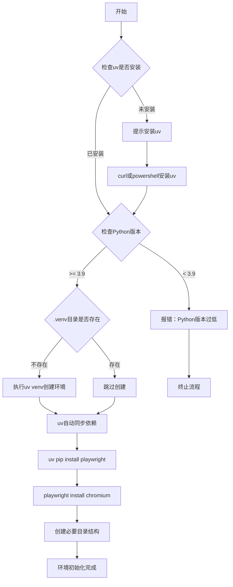
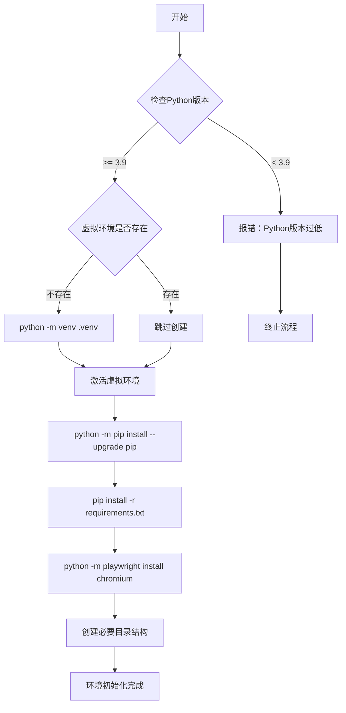
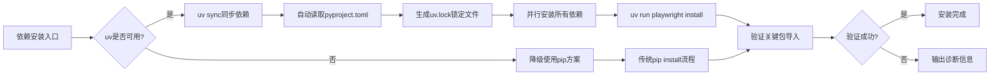
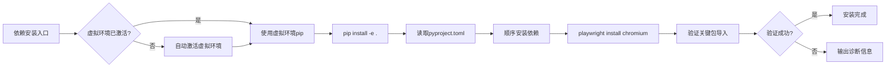

# 虚拟环境设置设计文档

## 设计目标

为"网页数据抓取工具"项目建立标准化的Python虚拟环境管理方案，解决当前依赖安装和环境隔离问题，确保项目能够在Windows和Linux/Mac跨平台环境下正常启动和运行。

## 问题分析

### 当前状态

- 项目使用全局Python环境安装依赖
- 缺少虚拟环境隔离机制
- 现有脚本直接调用系统级pip和python
- 依赖包可能与其他项目冲突
- 无法保证环境一致性

### 核心问题

1. **环境隔离缺失**：所有依赖安装到系统Python，容易产生版本冲突
2. **跨平台兼容性**：仅有Windows bat脚本，缺少Linux/Mac支持
3. **依赖管理不规范**：未使用虚拟环境最佳实践
4. **环境激活复杂**：用户需手动激活虚拟环境

## 解决方案

### 方案选型

采用 **uv** 作为主推虚拟环境和包管理方案，同时提供传统 **venv** 作为备选，理由如下：

**uv 优势：**
- 安装速度比 pip 快 10-100 倍
- 内置虚拟环境管理（uv venv）
- 自动依赖解析和锁定（uv.lock）
- 统一的工具链（uv run、uv pip、uv sync）
- 兼容 pip 和 requirements.txt
- Rust 实现，性能优越

**venv 备选理由：**
- Python 原生支持，零依赖
- 用户无需额外安装工具
- 适合不熟悉 uv 的传统用户

方案对比：

| 方案 | 优势 | 劣势 | 采用策略 |
|------|------|------|----------|
| **uv** | 极快速度、现代化工具链、自动锁定 | 需单独安装 | ✅ 主推方案 |
| **venv** | 原生支持、零依赖、简单可靠 | 功能基础、速度慢 | ✅ 备选方案 |
| virtualenv | 功能丰富、兼容性好 | 需额外安装、被 uv 替代 | ❌ 不采用 |
| conda | 科学计算生态强大 | 体积大、复杂度高 | ❌ 不采用 |

### 架构设计

#### 虚拟环境目录结构

**使用 uv 时的结构：**

```
mcp_linux_tool/
├── .venv/                          # uv创建的虚拟环境
│   ├── Scripts/                    # Windows可执行文件
│   │   ├── python.exe
│   │   ├── pip.exe
│   │   └── activate.bat
│   ├── bin/                        # Linux/Mac可执行文件
│   │   ├── python
│   │   ├── pip
│   │   └── activate
│   └── Lib/site-packages/          # 依赖包安装位置
├── uv.lock                         # uv依赖锁定文件（新增）
├── activate_venv.bat               # Windows自动激活脚本（新增）
├── activate_venv.sh                # Linux/Mac自动激活脚本（新增）
├── install_uv.bat                  # Windows uv安装脚本（新增）
├── install_uv.sh                   # Linux/Mac uv安装脚本（新增）
├── install.bat                     # Windows传统安装（备选）
├── install.sh                      # Linux传统安装（备选）
├── run.bat                         # Windows启动脚本（更新）
├── run.sh                          # Linux启动脚本（新增）
├── requirements.txt                # pip兼容依赖列表
├── pyproject.toml                  # 项目元数据和uv配置
└── .gitignore                      # 忽略.venv和uv.lock（新增）
```

**使用传统 venv 时的结构：**

```
mcp_linux_tool/
├── .venv/                          # venv创建的虚拟环境
│   ├── Scripts/                    # Windows
│   ├── bin/                        # Linux/Mac
│   ├── Lib/                        # 依赖包
│   └── pyvenv.cfg                  # 环境配置
├── activate_venv.bat               # Windows激活
├── activate_venv.sh                # Linux激活
├── install.bat                     # Windows安装
├── install.sh                      # Linux安装
├── run.bat                         # Windows运行
├── run.sh                          # Linux运行
├── requirements.txt                # 依赖列表
└── pyproject.toml                  # 项目配置
```

#### 环境创建流程

**方案A：uv 环境创建流程（推荐）**



**方案B：传统 venv 流程（备选）**



#### 依赖安装策略

**uv 安装策略（推荐）：**



**传统 pip 安装策略（备选）：**



### 功能设计

#### 1. uv 安装脚本（新增）

**install_uv.bat (Windows)**

职责：
- 自动下载和安装 uv 工具
- 配置 uv 到系统 PATH
- 验证 uv 安装成功

行为流程：
1. 使用 PowerShell 下载 uv 安装器
2. 执行安装命令：`powershell -c "irm https://astral.sh/uv/install.ps1 | iex"`
3. 刷新环境变量
4. 验证：`uv --version`
5. 显示安装成功提示

**install_uv.sh (Linux/Mac)**

职责：
- 使用 curl 下载 uv
- 安装到用户目录
- 配置 shell 环境

行为流程：
1. 执行：`curl -LsSf https://astral.sh/uv/install.sh | sh`
2. 添加 PATH 到 ~/.bashrc 或 ~/.zshrc
3. 验证 uv 命令可用
4. 输出使用指导

#### 2. 自动化激活脚本

**Windows激活脚本 (activate_venv.bat)**

职责：
- 检测并创建虚拟环境
- 自动激活虚拟环境
- 保持命令行会话处于激活状态
- 提供环境状态提示

行为流程：
1. 检查.venv目录是否存在
2. 不存在则优先尝试 `uv venv`，失败则使用 `python -m venv .venv`
3. 执行.venv\Scripts\activate.bat激活
4. 显示虚拟环境激活成功提示
5. 停留在激活状态的命令行环境

**Linux/Mac激活脚本 (activate_venv.sh)**

职责：
- 跨平台环境检测
- 创建并激活虚拟环境
- 兼容bash/zsh等不同shell
- 提供环境变量配置指导

行为流程：
1. 检查操作系统类型
2. 验证Python3可用性
3. 优先尝试 `uv venv`，失败则使用 `python3 -m venv .venv`
4. source方式激活环境
5. 显示激活状态和退出方法

#### 3. 环境安装脚本改造

**更新install.bat（主推uv）**

关键变更：
- 第一步：检测 uv，不存在则提示安装
- 第二步：使用 `uv venv` 创建虚拟环境
- 第三步：`uv sync` 同步依赖（从 pyproject.toml）
- 第四步：`uv run playwright install chromium`
- 第五步：创建目录和验证

备选模式（uv不可用）：
- 使用传统 `python -m venv .venv`
- 激活环境后 `pip install -e .`
- 手动安装 playwright 驱动

**创建install.sh（新增）**

目标：
- 支持Linux/Mac一键安装
- 与Windows保持功能对等
- 处理权限和路径差异

特殊处理：
- 使用python3命令而非python
- 检查pip3可用性
- 处理shell脚本执行权限
- 优先尝试 uv，失败退回 pip

#### 4. 运行脚本改造

**更新run.bat（支持uv run）**

改进内容：
- 优先尝试 `uv run main.py`（自动激活环境）
- uv不可用时降级为传统模式
- 检测虚拟环境是否存在
- 不存在时提示先运行安装脚本
- 传统模式：激活环境后执行 `python main.py`

**创廻run.sh（新增）**

功能：
- 跨平台启动入口
- 优先使用 `uv run main.py`
- 虚拟环境自动检测
- 错误提示和引导

#### 5. VS Code集成配置

**创建.vscode/settings.json**

配置项：
- python.defaultInterpreterPath：指向.venv中的Python
- python.terminal.activateEnvironment：启用自动激活
- files.exclude：隐藏.venv目录避免干扰
- python.formatting.provider：配置black格式化
- python.linting.enabled：启用ruff检查

**创建.vscode/launch.json**

调试配置：
- 使用虚拟环境解释器
- 配置主程序入口为main.py
- 设置工作目录为项目根目录
- 支持断点调试和变量检查

**创建.vscode/extensions.json（新增）**

推荐插件：
- ms-python.python：Python 支持
- ms-python.vscode-pylance：语言服务
- charliermarsh.ruff：Ruff 代码检查
- ms-python.black-formatter：Black 格式化

#### 6. 环境验证脚本

**创建verify_env.py**

验证内容：
- Python版本检查（>= 3.9）
- 虚拟环境激活状态（检查VIRTUAL_ENV环境变量）
- uv 工具可用性（可选）
- 所有依赖包导入测试（PyQt6, playwright, beautifulsoup4等）
- Playwright浏览器驱动安装状态
- 必要目录存在性检查（config, data）
- pyproject.toml 配置有效性

输出格式：
- 检查项目名称
- 通过/失败状态标识（✅/❌）
- 失败时的修复建议
- 整体环境健康度评分（100分制）
- uv 可用性提示（如果使用）

### 依赖包管理策略

#### 依赖分类

| 类型 | 包名 | 用途 | 安装时机 |
|------|------|------|----------|
| GUI框架 | PyQt6, PyQt6-WebEngine | 图形界面 | 核心依赖 |
| 浏览器自动化 | playwright | 网页控制 | 核心依赖 |
| 数据解析 | beautifulsoup4, lxml | HTML提取 | 核心依赖 |
| 数据处理 | pandas, openpyxl, xlsxwriter | 导出功能 | 核心依赖 |
| 安全加密 | cryptography | Cookie加密 | 核心依赖 |
| 异步IO | aiofiles | 文件操作 | 核心依赖 |
| 开发工具 | pytest, black, ruff, mypy | 测试和代码质量 | 可选依赖 |

#### 版本锁定策略

- requirements.txt：使用 >= 保持兼容性更新
- 生产环境：建议使用 == 锁定精确版本
- 定期更新：每月检查安全漏洞和新版本

#### 依赖隔离原则

- 核心依赖：必须在requirements.txt中声明
- 开发依赖：在pyproject.toml的[dev]组中管理
- 系统依赖：仅依赖Python标准库（sqlite3, json, csv）

### 跨平台兼容性设计

#### 路径处理

- 使用os.path.join或pathlib.Path构建路径
- 避免硬编码Windows反斜杠
- 配置文件使用相对路径

#### 脚本兼容

| 功能 | Windows实现 | Linux/Mac实现 | 共同点 |
|------|-------------|---------------|--------|
| 环境创建 | python -m venv | python3 -m venv | 使用venv模块 |
| 激活路径 | .venv\Scripts\activate.bat | source .venv/bin/activate | 激活脚本位置 |
| Python命令 | python | python3 | 可能不同 |
| Pip命令 | pip | pip3 | 可能不同 |

#### 编码处理

- 所有文本文件使用UTF-8编码
- Windows bat脚本保存为GBK避免中文乱码
- Shell脚本使用UTF-8并声明 #!/bin/bash

### 用户操作流程

#### 首次安装流程

**方案A：使用 uv（推荐）**

**Windows用户：**
1. 双击运行 `install_uv.bat` 安装 uv 工具
2. 双击运行 `install.bat` 创建环境和安装依赖
3. 等待 uv 同步完成（速度极快）
4. 安装完成后运行 `run.bat` 或 `uv run main.py` 启动程序

**Linux/Mac用户：**
1. 终端执行 `chmod +x *.sh` 赋予执行权限
2. 运行 `./install_uv.sh` 安装 uv
3. 运行 `./install.sh` 创建环境
4. 完成后执行 `./run.sh` 或 `uv run main.py` 启动

**方案B：传统 venv（备选）**

**Windows用户：**
1. 双击运行 `install.bat`（会自动检测uv，不存在则使用venv）
2. 等待虚拟环境创建和依赖安装
3. 安装完成后运行 `run.bat` 启动程序

**Linux/Mac用户：**
1. 终端执行 `chmod +x install.sh run.sh`
2. 运行 `./install.sh`
3. 完成后执行 `./run.sh` 启动

#### 日常开发流程

**方式一：使用 uv run（最简单）**
- 任何平台：直接执行 `uv run main.py`
- 自动激活环境并运行
- 无需手动激洿操作

**方式二：使用激活脚本**
- Windows：双击 `activate_venv.bat`，然后执行 `python main.py`
- Linux/Mac：执行 `source activate_venv.sh`，然后 `python main.py`

**方式三：使用IDE**
- 打开VS Code，自动识别虚拟环境
- F5直接启动调试
- 终端自动激活环境

**方式四：使用运行脚本**
- Windows：双击 `run.bat`
- Linux/Mac：执行 `./run.sh`

#### 依赖管理流程

**添加新依赖：**

使用 uv：
```bash
# 添加生产依赖
# uv add <package-name>

# 添加开发依赖
# uv add --dev <package-name>

# 同步更新
# uv sync
```

使用 pip：
```bash
# 激活环境后
# pip install <package-name>

# 更新 requirements.txt
# pip freeze > requirements.txt
```

**更新依赖：**

使用 uv：
```bash
# uv sync --upgrade
```

使用 pip：
```bash
# pip install --upgrade -r requirements.txt
```

### 环境问题诊断机制

#### 常见问题处理

| 问题现象 | 可能原因 | 解决方案 |
|---------|---------|---------|
| 提示缺少PyQt6 | 未激活虚拟环境 | 运行activate_venv脚本 |
| Playwright启动失败 | 浏览器驱动未安装 | 执行playwright install chromium |
| 导入错误 | 依赖版本冲突 | 删除.venv重新安装 |
| 权限错误 | Linux脚本不可执行 | chmod +x *.sh |
| pip安装慢 | 网络或镜像源问题 | 配置国内镜像源 |

#### 自动检测机制

在启动脚本中嵌入检测逻辑：

**uv 环境检测：**
1. 检查 uv 命令是否可用
2. 检查 .venv 目录是否存在
3. 检查 uv.lock 文件是否存在
4. 尝试导入关键包（PyQt6, playwright）
5. 失败时输出详细错误信息和修复建议

**传统 venv 检测：**
1. 检查.venv目录是否存在
2. 检查虚拟环境是否激活（VIRTUAL_ENV环境变量）
3. 尝试导入关键包（PyQt6, playwright）
4. 失败时输出详细错误信息和修复建议

**验证脚本调用：**
- 运行 `python verify_env.py` 或 `uv run verify_env.py`
- 全面检查环境状态
- 生成详细诊断报告

#### 环境重置方案

当环境损坏时：

**使用 uv：**
1. 删除.venv目录和uv.lock文件
2. 重新运行install脚本
3. uv 重新同步依赖

紧急修复命令：
- Windows: `rmdir /s /q .venv && del uv.lock && install.bat`
- Linux/Mac: `rm -rf .venv uv.lock && ./install.sh`

**使用传统 venv：**
1. 删除.venv目录
2. 重新运行install脚本
3. 完全重建虚拟环境

紧急修复命令：
- Windows: `rmdir /s /q .venv && install.bat`
- Linux/Mac: `rm -rf .venv && ./install.sh`

### 文档更新需求

#### 更新README.md

新增章节：
- 虚拟环境说明
- 快速安装指令
- 跨平台使用指南
- 常见问题FAQ

#### 更新QUICKSTART.md

调整安装步骤：
- 第一步：创建虚拟环境
- 第二步：激活虚拟环境
- 第三步：安装依赖
- 第四步：启动程序

#### 创建环境配置文档

新建ENVIRONMENT.md：
- 虚拟环境原理说明
- 不同操作系统配置差异
- IDE集成配置教程
- 高级环境管理技巧

### 实施优先级

#### P0 - 关键功能（必须完成）

1. 创建 install_uv.bat 和 install_uv.sh（uv 安装脚本）
2. 创建 activate_venv.bat 和 activate_venv.sh（支持 uv 和 venv）
3. 更新 install.bat 支持 uv 优先模式
4. 更新 run.bat 支持 uv run 命令
5. 创建 .vscode 配置文件

#### P1 - 重要功能（应当完成）

1. 创建 install.sh 和 run.sh（Linux/Mac 支持）
2. 实现 verify_env.py 验证脚本（支持 uv 检测）
3. 更新 README.md 和 QUICKSTART.md（添加 uv 说明）
4. 添加 .gitignore 忽略 .venv 和 uv.lock
5. 创建 pyproject.toml 的 uv 相关配置

#### P2 - 增强功能（建议完成）

1. 创建 ENVIRONMENT.md 详细文档（包含 uv 使用指南）
2. 添加 requirements-dev.txt 开发依赖
3. 集成 pre-commit 钩子
4. 提供 Docker 环境方案
5. 创建 uv 镜像源配置指南

### 风险评估

| 风险项 | 影响程度 | 缓解措施 |
|--------|---------|---------|
| 用户不熟悉虚拟环境概念 | 中 | 提供详细文档和一键脚本 |
| 跨平台兼容性问题 | 中 | 充分测试Windows/Linux/Mac |
| Playwright驱动下载失败 | 高 | 提供离线安装包和镜像源配置 |
| 依赖包版本冲突 | 中 | 锁定核心依赖版本 |
| IDE不识别虚拟环境 | 低 | 提供手动配置指南 |

### 验收标准

- ✅ uv 可在 Windows/Linux/Mac 上成功安装
- ✅ 虚拟环境可通过 uv 或 venv 在各平台成功创建
- ✅ 依赖包全部安装到 .venv 目录而非系统环境
- ✅ `uv run main.py` 能直接启动程序（无需手动激活）
- ✅ 运行脚本能自动激活环境并启动程序
- ✅ VS Code 能正确识别虚拟环境解释器
- ✅ verify_env.py 验证脚本所有检查项通过
- ✅ uv 不可用时能自动降级到传统 pip 方式
- ✅ 不同用户按文档操作能成功运行程序
- ✅ 删除 .venv 后可通过 install 脚本完全重建

### 后续优化方向

1. **性能优化**
   - 利用 uv 的极速安装能力
   - 配置 uv 缓存目录加速重复安装
   - 探索 uv 的并行安装特性

2. **用户体验**
   - 开发图形化安装向导
   - 提供环境健康度检查面板
   - 集成 uv 工具链管理界面

3. **CI/CD集成**
   - GitHub Actions 中使用 uv 加速构建
   - 多平台环境验证
   - 自动化依赖更新检查

4. **高级特性**
   - 支持多 Python 版本切换
   - 使用 uv 管理 Python 版本
   - 集成 pyenv 实现版本管理
   - 提供容器化部署方案
   - 探索 uv 的 workspace 功能
